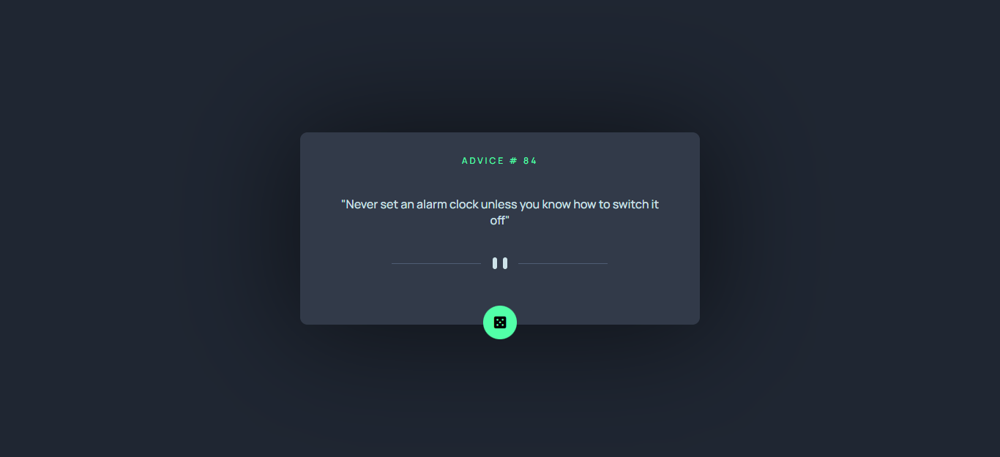
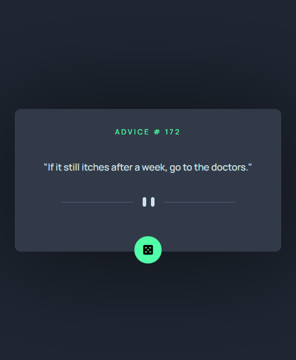

# CHECKOUT PAGE - Responsive page

## Overview

  <h3>   Demo - URL link -
    <a href="https://advicegenerator-by-sumyat.netlify.app/">
    https://advicegenerator-by-sumyat.netlify.app/
    </a>
  </h3>

 
 

 
 

 
 

## Challenge

###  [Expenses chart component challenge on Frontend Mentor](https://www.frontendmentor.io/challenges/advice-generator-app-QdUG-13db)

 
 

## Built With

- **HTML**
- **CSS**
- **JS**

## Features

- **Responsive and look great on all devices**
- **Generate random advice with one click**
- **Used Fetch Api**
